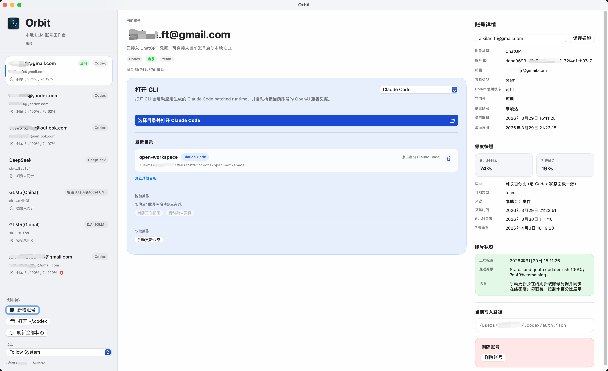

# Orbit

[English README](README.md)

Orbit 是一个原生 macOS 本地 LLM 账号工作台，用来在一台机器上统一管理 Codex、Claude 和各类 provider 账号。它会集中保存账号状态与额度信息，并在启动 Codex CLI 或 Claude Code 时，按当前账号自动应用正确的模型、provider 和桥接路径。

项目面向 macOS 14 及以上。如果通过终端构建，需要 Swift 6 工具链。

## 核心功能

- 在一个应用里统一管理 ChatGPT OAuth 账号、OpenAI-compatible provider API Key、Claude-compatible provider API Key，以及可切换的本地 `Claude Profile` 快照。
- 为当前选中的账号选择工作目录后直接启动 Codex CLI 或 Claude Code，并按账号维度保存最近目录，方便后续快速重开。
- 自动更新 `~/.codex/auth.json` 来切换当前激活的 Codex 账号；对于非当前激活账号，则使用独立 `CODEX_HOME` 启动，不改写现有全局 auth 文件。
- 把 provider 规则、显示名称、Base URL、API Key 环境变量和默认模型直接保存在账号上，后续启动时自动套用。
- 当上游 provider 需要协议转换时，自动在本地选择直连或桥接，不要求用户手动处理。
- 支持导入当前 `~/.claude` 与 `~/.claude.json` 作为本地 `Claude Profile`，也支持保存 Anthropic API Key 以承接 Claude 侧工作流。
- 查看账号详情，包括套餐类型、Codex 使用状态、可用性、额度限制、最后刷新时间和最后使用时间。
- 从本地 Codex 产物中归档额度快照：`~/.codex/sessions/*.jsonl` 与 `~/.codex/state_5.sqlite`；对支持的账号刷新在线额度，并在当前 5 小时额度偏低时给出切换建议。
- 切换后检测运行中的 Codex 是否仍持有旧登录态，并在需要时提示重启 Codex。
- 将应用数据保存在 `~/Library/Application Support/Orbit/` 下，避免触发钥匙串授权弹窗。

## 截图示例

### 统一账号工作台



主工作台把账号切换、账号详情、额度快照、状态日志、最近目录和 CLI 目标切换整合在一个界面里。你可以在同一处查看当前账号状态，并决定下一次启动是打开 Codex CLI 还是 Claude Code。

### 用 OpenAI-compatible provider 启动 Codex CLI


Orbit 可以用 OpenAI-compatible provider 账号启动 Codex CLI，例如图里的 GLM 类场景。应用会自动注入账号上保存的 provider、模型和 API Key 环境变量；如果上游只提供 `chat/completions`，则会自动起本地 bridge 再启动。

### 用桥接后的 OpenAI/Codex 凭据启动 Claude Code


Orbit 也可以从 Codex 账号或 provider 账号直接打开 Claude Code。应用会准备托管的 patched runtime，把已保存的凭据桥接到 Claude 侧环境里，并沿用该账号已经配置好的模型流转方式，而不要求你额外登录 Claude。

## 命令

### 运行应用

```bash
swift run
```

也可以直接用 Xcode 打开 `Package.swift`，按 macOS App 方式运行。

### 运行测试

```bash
swift test
```

### 打包分发版本

```bash
./scripts/package_app.sh
```

打包脚本会在 `dist/` 下生成这些产物：

- `Orbit.app`
- `Orbit.zip`
- `assets/AppIcon.icns`
- `assets/AppIcon-master.png`
- `assets/MenuBarIcon-template.png`

## 限制与说明

- Claude 当前支持本地 `Claude Profile` 导入、Anthropic API Key 管理，以及 Claude CLI / Claude Code 启动；不支持 `claude.ai OAuth` 切换。
- `Claude Profile` 只保存 `~/.claude` 与 `~/.claude.json` 的本地快照，不代表官方 `claude.ai` 或 Console 登录态。
- 部分 provider 不直接暴露 OpenAI Responses API。Orbit 仍可通过本地 bridge 启动受支持的工作流，但 README 只描述当前启动行为，不额外承诺更宽泛的 provider 兼容性。
- API Key 账号支持本地凭据切换；是否支持在线额度刷新，取决于具体 provider 和账号类型。
- 手动刷新在支持时会优先拉取在线额度数据，之后如果本地会话里出现更新事件，快照仍可能被更新的数据覆盖。
